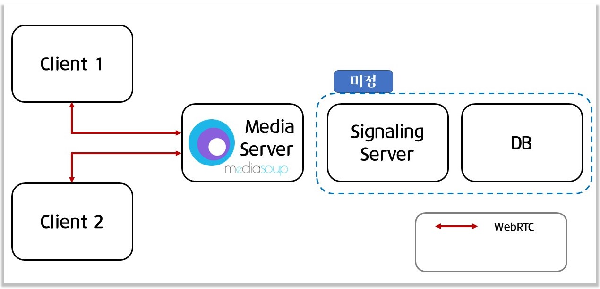
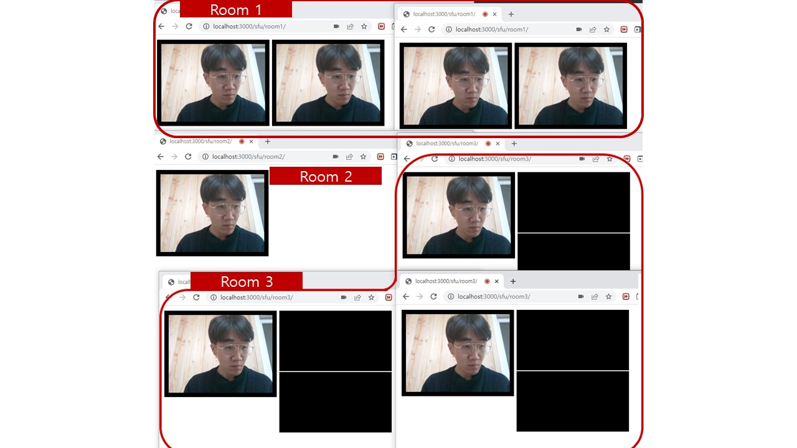

# 미디어 서버(시그널링 서버)
## **1. 역할**

|**서비스**|**역할**|
|:------:|:---|
|`미디어 서버`| 1. SFU 방식의 서버를 사용하여 <br>**클라이언트의 부하 감소** <br>2. WebRTC를 이용한 화상채팅 및 음성채팅 제공<br>|
|`시그널링 서버`| 1. 사용자간의 연결성 파악<br>2. 사용자의 현재 위치정보를 제공 및 저장|


<br>

## **2. 기술스택**
---
* Node.js 18.12
* socket.io
* WebRTC
* [Mediasoup v3](https://mediasoup.org/documentation/v3/mediasoup/installation/#requirements)
* Mediasoup-client
* bundle.js
* `DB는 아직 정하지 못했음`
<br><br>
실시간 테스팅을 위해 사용

  * [watchify](http://watchify.org/)
  
<br>

## **3. 아키텍처**
---


<br>


## **4. 기능**
---
|**제공 기능**|**설명**|
|:------:|:---|
|**유저 상태<br> 파악**| 1. 웹 소켓 설정을 통해 방 입장 및 퇴장을 관리 <br>2. 입장한 방의 유저들간의 P2P연결 진행<br>3. |
|**정보 저장**| - 방의 갯수, 유저간의 연결 상태를 NoSQL형식으로 저장<br>|
| 추가 <br>기능 | 기능 설명 ... |


<br>

## **4.1 기능 설명**
---
### Server 쪽

현재 서버 쪽에서 NoSQL 방식으로 저장하는 data는 총 5가지

|**데이터**|**설명**|**저장 방식**|
|:--------:|:-----------:|:-------|
|Rooms|존재하는 룸의 {Router, 및 peers의 ip}|{ roomName1: { Router, peers: [ socketId1, ... ] }, ...}|
|Peers|Peer의 IP 정보에 따른, Room의 위치, socket 그리고 peer들의 정보`(Workers의 id인지 제공자의 id인지는 확인해봐야함)`|{ socketId1: { roomName1, socket, transports = [id1, id2,] }, producers = [id1, id2,] }, consumers = [id1, id2,], __ }, ...}|
|Transports|:-------|[ { socketId1, roomName1, transport, consumer }, ... ]|
|Producers|Client가 접속했을 때, producers의 정보|[ { socketId1, roomName1, producer, }, ... ]|
|Consumers|Client가 meida를 제공해줘야할 Consumer의 정보|[ { socketId1, roomName1, consumer, }, ... ]|


<br> 

### 1. **방 입장**
```   
socket.on('joinRoom', async({roomName}, callback) => 
{
  // create router if room is note exist
  const router1 = await createRoom(roomName, socket.id)
  peers[socket.id] = {
    ....
  }
  // get Router RTP capabilities
  const rtpCapabilities = router1.rtpCapabilities
  callback({rtpCapabilities})
})
```
  - createRoom 함수를 통해 
    1. 방이 있을 경우 : Rooms 에 저장된 Router id를 통해 입장
    2. 방이 없을 경우 : Rooms 에 Router id를 저장 후 방을 생성

<br>


## **5.1 구현 정도**
---
1. 방 입장 기능 구현

2. 입장한 방에 따라 유저간의 연결이 다름
<br>


3. 영상 정보 전송 
    - 오디오 정보 미구현
    - 화면 공유 미구현

4. Room의 개수 및 Peers의 상태 저장
<br><br>

<현재 진행 상황>

<br>

## **5.2 에러 사항**
---
1. Ctrl + C, Ctrl + V 로 방에 입장 시 error 발생 <br>-> 입장시에 발생하는 문제인것 같음
2. ~~현재 영상이 모든 방 포함 최대 2개까지만 공유됨~~ 
3. ~~퇴장시 영상정보 삭제가 안됨~~ 23.01.22 update 
4. 에러 이후 server복구가 안 됨
5. Edge로 들어가면 접근이 안 됨<br>(다른 브라우저들은 확인 못해봄)
<br><br>

<에러 사항>

<br>

## **6. Media soup 사용한 이유**
---
**1. LowLevel의 API로 업데이트 및 변경이 간단**<br>

**2. SFU방식을 채택한 오픈소스로 서버 제작의 부담을 줄여줌.**<br>

**3. WebRTC 중 Object를 사용하는 ORTC 사용**
  - 사용자의 위치정보를 보다 간단하게 받아올 수 
  있음
  - object의 조작 및 접근이 용이

**4. 접근 방식에 변형을 주면 Signaling Server로 사용가능**
  - 디스코드는 버튼을 이용하여 Room을 이동
    - 버튼을 누르기 전까지는 유저간의 연결성이 없음
    - 즉, 버튼을 누르기 전까지 유저의 위치를 추적가능
<br>


## **7. 주의사항** 
---
1. Openssl을 이용해서 인증서를 깔아둬야함
* use #openssl req# to get key.pem & cert.pem 
* https 를 기반으로 해서 그런지
<br>default설정을 조정을 안해서 그런지 파악은 안 되지만,<br>인증서가 없으면 실행이 안 됨

2. Mediasoup **`설치가 까다로우니`** referenc를 잘 참조허여 설치하기 바람
<br>

### **Reference**
---
* [WebRTC Overview](https://trembit.com/blog/webrtc-media-servers-overview-and-explanation-what-to-choose/)
* [WebRTC 이론](https://millo-l.github.io/series/WebRTC-%EC%9D%B4%EB%A1%A0%EB%B6%80%ED%84%B0-%EC%8B%A4%EC%A0%84%EA%B9%8C%EC%A7%80)
* [Mediasoup API](https://mediasoup.org/documentation/v3/mediasoup/api/)
* [Mediasoup-client API](https://mediasoup.org/documentation/v3/mediasoup/api/)
* [소켓통신 - DOCS](https://socket.io/docs/v4/)